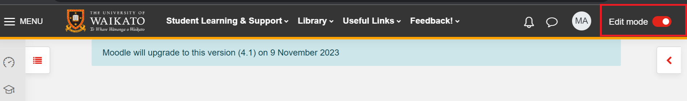

# The Checklist activity

Checklist is an activity which allows students or teachers to check off items as they are completed and thus have a customised record of progress.

## Add Checklist
1. At the top right of your Moodle paper, toggle Edit mode on.

