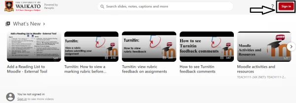
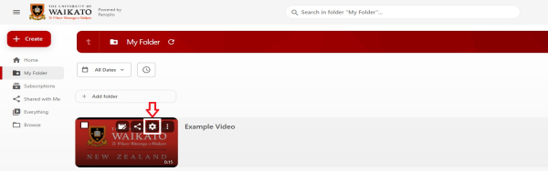
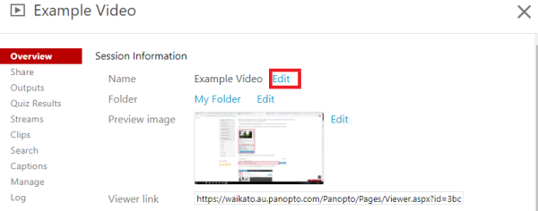
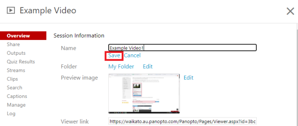
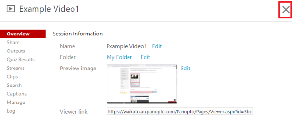

# Rename recordings

1. Go to the University of Waikato's Panopto server: https://waikato.au.panopto.com

2. On the top right corner, select **Sign in**.

   

3. **Sign in** with your standard Waikato username and password.

   

4. Move your mouse over the recording you would like to edit, then select the **Settings** icon.

   

5. In the settings pop up window, select **Edit** on the right of the recording's current name.

   

6. Enter the new name, then select **Save**.

     

7. To exit the settings window, select the X icon in the upper right-hand corner.

   

   
