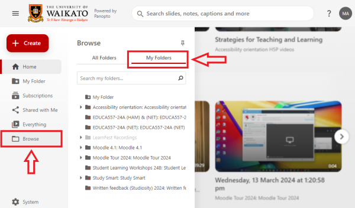
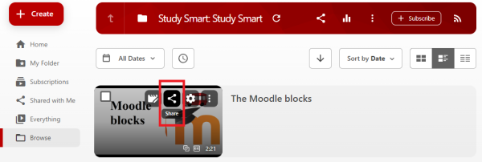
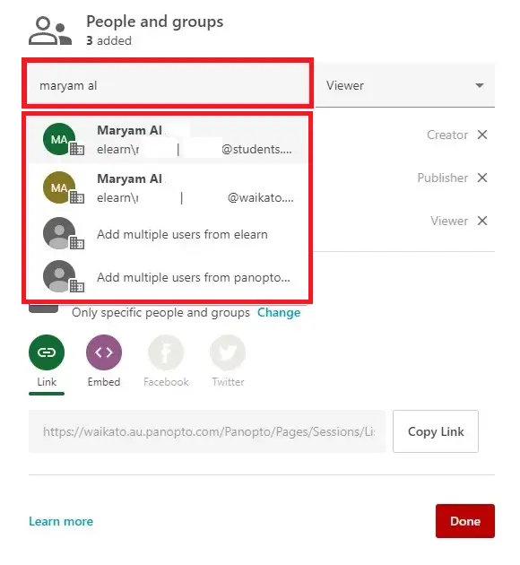
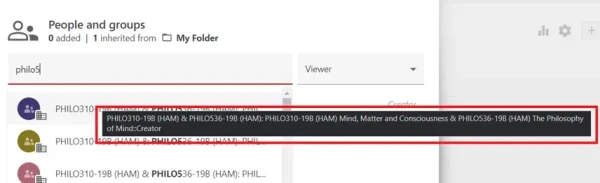
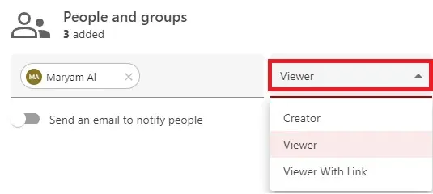
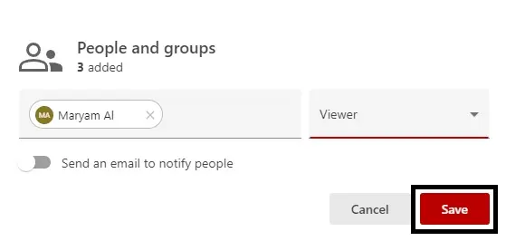
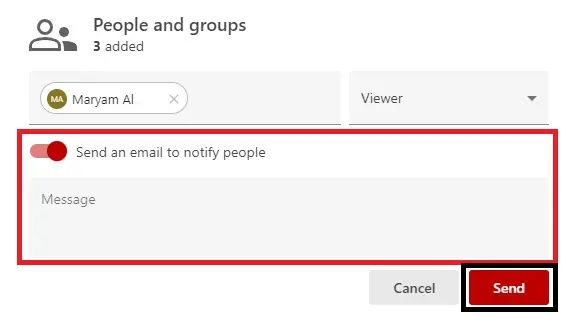
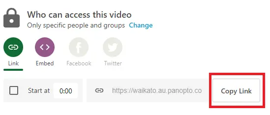

# Share an individual Panopto recording

> - The steps below outline how to share individual recordings from the University of Waikato's [Panopto server](https://waikato.au.panopto.com/Panopto/Pages/Home.aspx). You can follow the same process to Share folders.

> - You can also share a Panopto recording from your personal folder or from another paper folder to a Moodle paper via the new [Panopto embed button] in Moodle or the Panopto video resource. Participants in the destination Moodle paper will have viewing permission. You can use the Moodle Restrict access and Group tools to limit access.

1. Go to [waikato.au.panopto.com](https://waikato.au.panopto.com)
   
2. On the top right corner, click on **Sign in**.
   
  

3. **Sign in** with your standard University of Waikato username and password.
   
  

4. On the left-hand side menu, select **Browse**, then select **My Folders**, then select the **folder** that contains the recording you want to share.

    

6. Hover your pointer over the recording you want to share, and click on the **Share** icon.

   

8. A pop-up window will display options for **People and groups** and **Who can access this video**, which are described in the following sections.

   
   

 ## People and groups

 1. To add more people and groups to access the recording, start typing the user's or group's name in the **Add people and groups** box. Then, select the name you were looking for from the list.

     

> **Note**: If you are adding a paper group, there may be multiple options for the same paper code and year. Hover your cursor over the group to see the group's full name.

2. Select the **drop-down arrow** on the box to the right to choose the role options: Creator, Viewer, or Viewer With Link.

 3. When you are done, select **Save**. You will see the new people and groups added to the list below.

> **Note**: If you wish to send a notification to the participants you have selected, toggle the switch for **Send an email to notify people**, and a Message box will appear below for you to write a notification message. Then, select **Send**.

## Who can access video

1. By default, the video recording is set to **Restricted**, with the list of people and groups of people who have been granted access to the recording. To edit access restriction to the recording, select **Change** under **Who can access this video**.

2. A list of different types of access restrictions for the folder will appear. Select your preferred option.

   

* **Your Organization (unlisted)**: the person trying to access the video must be logged in with a University of Waikato account, and you need to send them the shared link via email.
* **Your Organization**: the person trying to access the video must be logged in with a University of Waikato account, but they do not need you to send them the link to the video to find it.
* **Public (unlisted)**: the person trying to access the video does not need a University of Waikato account to access the folder but still needs you to send them the video link to find it.
* **Public**: anyone looking for this video on the Internet can find and access it.

> **Note**: To share a link of the video recording via email, select **Copy Link**.

   
