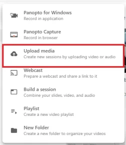
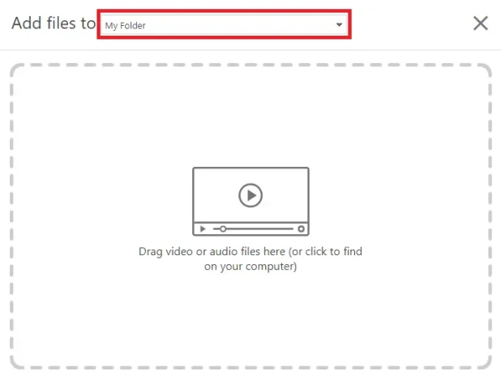

# Upload a recording

== These instructions are for uploading recordings which have been recorded in other software. ==

1. Go to https://waikato.au.panopto.com

2. **Sign in** using the drop-down menu in the top right corner using your standard Waikato account details.

   

3. At the left of the page, select **Create**.

    

4. Select **Upload media**.

5. Select the **folder** you wish to upload to, then **drag and drop** your file to upload. You can also **click to find** and upload a file.

   

 6. Finally, wait for the upload to complete.
