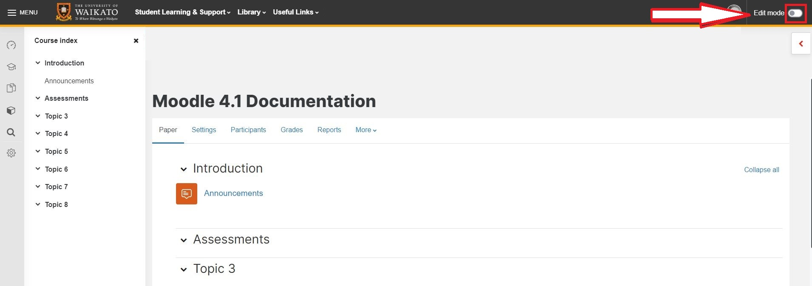
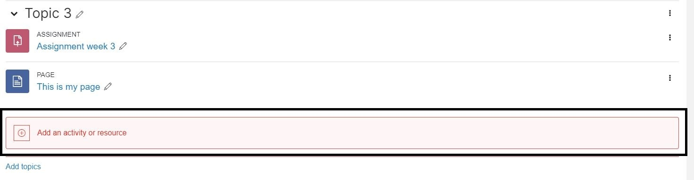
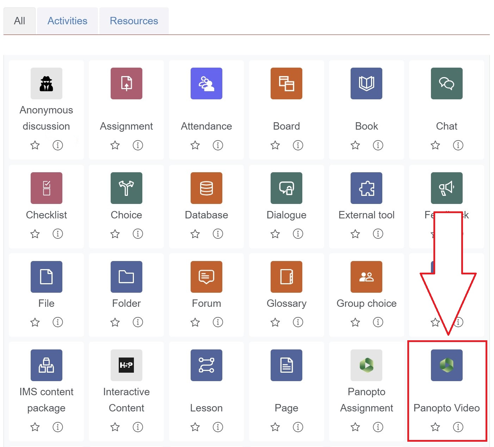
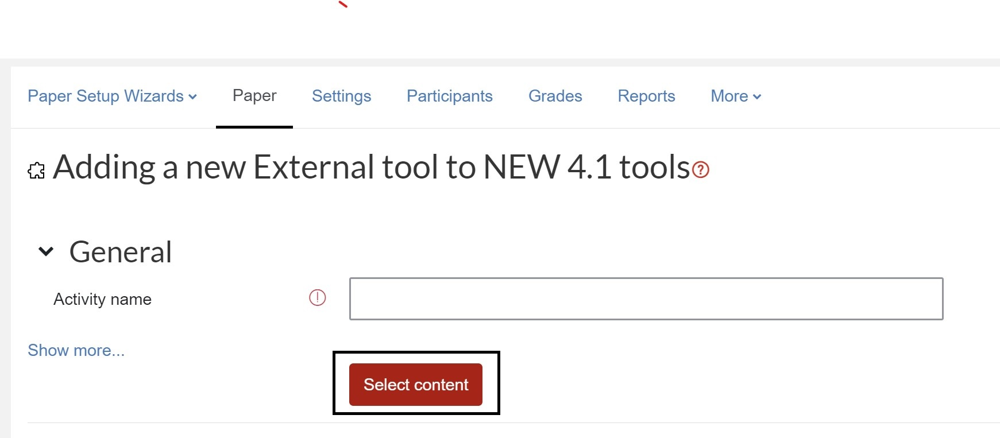
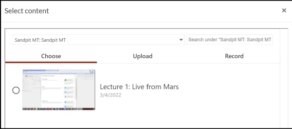
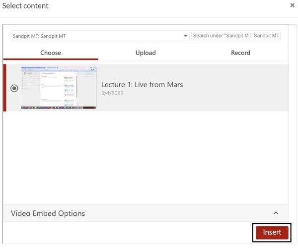

# The Panopto Video resource

> To add a Panopto recording to your Moodle paper, you can:
>
> - Add a Panopto recording to the Moodle Panopto block, which is on the right hand side of most papers.
> - Embed or link to a recording in most sections of your Moodle paper using the Panopto video resource.
> - Add recordings via [the Panopto embed button](the-panopto-embed-button.md) of the Moodle text editor.
>
> See also [Panopto assignments](student-assignments.md) if you would like students to submit video or audio content for an assignment.

This page explains how to add Panopto content to a central section of your Moodle paper using the Panopto Video resource.

You can:

- add a single recording from your Moodle paper or elsewhere, including other Moodle papers that you can access, or
- add a link to your Moodle paper's Panopto folder.

1. Go to your Moodle paper and toggle on **Edit mode** at the top right of the page.

2. At the bottom of the relevant central section, select **Add an activity or resource**.

3. In the pop-up menu, select **Panopto Video**.

4. In the General section, click on **Select content**.

?> **Note:** If you are adding a single video, you can leave the **Name** field blank unless you want to change the name of the video: the name of the selected video in Panopto will automatically display as the activity name.

5. In the Select content pop-up window, you can:
  - **Choose** among the videos in the current paper's folder by selecting the **radio button** to the left of each video, or use the **dropdown menu** and **search box** at the top of the window to select a video from another Panopto folder.
  - **Upload** video or audio files.
  - **Record** video or audio.

See the [Select content section](#Select-content-options) at the bottom of this page for more information. 

6. After you have selected your content, select **Insert** at the bottom right of the pop-up window

7. Finally, **scroll down** and select **Save and return to paper** or **Save and display**.

## Add a Panopto folder link

To add a link to all the videos in your paper's Panopto folder, follow steps 1-3 above, enter an **Activity name** (e.g. Videos), then **scroll down** and select **Save and return to paper** or **Save and display**. Do not click on Select content.

> **Note:**
> - You can't currently select several individual videos and insert them into the one Panopto Video resource.
> - You do not need to update the folder link when you record more videos.
> - To point students to a sub-folder, link to the main paper folder and advise them to select the **Video resource**, then select the **sub-folder** (subfolder links appear above the individual videos) or search by the sub-folder name at the top left.

## Restrict access

?> **Note:** As with other Moodle activities and resources, you can restrict access by group, date, activity completion or user profile. See the Restrict access page for more details.

1. In your Moodle paper, select the **Panopto video** activity.
2. Select the **Settings** tab.
3. **Scroll down** and select the **Restrict access** section, then select **Add restriction**.
4. **Scroll down** and select **Save and return to paper** or **Save and display**.

## Select content options

### A. Choose

Use this option to add any content that you have access to in Panopto.

In the Select content window, **Choose** should be preselected as the default option. If not, select Choose, then:

- To add a recording from the same paper, select the **radio button** to the left of the relevant video in the list.

- To add a recording from another Panopto folder, including your personal My Folder or a public folder, in the search box at the top left select the **down arrow**, then select the **folder**, or start typing the folder name to search, then select the **radio button** to the left of the relevant video in the list.

> **Note:**
> - When you click into the folder search box at the top left, recently accessed folders will appear at the top of the drop-down list.
> - You can search within paper folders by entering a recording name in the search box at the top right.

### B. Upload

Use this option to add content from your device. You can also Upload to Panopto, then use **Choose** as above.

1. In the Select content window, select **Upload**.

2. **Drag and drop** the file into the Upload box, or click into the Upload box to **search** for your file.

### C. Record

Select this option to record directly to the Moodle Panopto video activity.

1. In the Select content window, select **Record**.

2. Enter a name in the **Name your recording** text box.

3. Scroll down to see your options for recording under 'How would you like to record?'.

### A. Browser

If you'd like to use the browser version of Panopto, select **Launch Capture** under Capture (Browser) on the left.

- This will open a new browser tab in which a recording screen will appear. To start your recording, select the red circle at the bottom middle of the screen. To stop recording, select the red square at the bottom middle of the screen.

?> **Note:** You can also select **Screen and apps** at the top right to open another browser tab where you can select sharing options. Return to the recording tab to record. 

- After stopping the recording, you can review your recording. You can select buttons on the right to Redo or Edit your recording.

- If you are happy with your recording, **close the tab**. When it is ready, your recording will appear in the Moodle tab, in the Select content box. Here, you can select the play arrow on the recording to review, select **Start Over** under the recording if you wish, or select the **Insert** button at the bottom right of the Select content box.

### B. App

Select **Launch App** under Panopto for Windows (App) on the right.

?> **Note:** If you do not already have the Panopto App select **Download** below Launch App and follow the prompts.

- After selecting **Launch App**, a pop-up box may appear (depending on your browser and settings), select **Open** and the Panopto App will open.

- Record in the Panopto app as you normally would: see [Create a recording](create-a-recording-or-webcast.md), steps 5-10 for more information (ignore the note on webcasting).

- Once the **Manage Recordings** screen appears, you can close the app.

- Your recording should appear on the Moodle tab, in the Select content box. Select the **play arrow** on the recording if you wish to review it, select **Start Over** under the recording to redo, or select the **Insert** button at the bottom right of the Select content box to add to the Panopto activity.

?> **Note:** You don't need to wait until the file has processed to Insert it and Save the Panopto video activity to your Moodle paper. The video will become available when it has finished processing.
