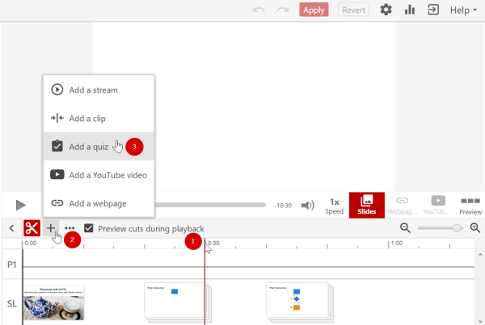

# Adding a quiz to a Panopto recording

<iframe width="560" height="315" src="https://www.youtube.com/embed/yAvWM8bF2E4?si=8PsNgdCM1QKXFnLY"></iframe>

To begin, click the edit button that appears when you hover the mouse pointer over a recording, then:

1. Click on the timeline at the point where you want the quiz to appear.

2. Click on the **+ Add** content icon.

3. Click **Add a quiz** (or if you prefer Add a YouTube video or Add a webpage).

When you’ve added your quiz questions (or YouTube video or webpage), click the Apply button to save your changes and re-encode the recording.

There are [more detailed instructions](https://support.panopto.com/s/article/How-to-Add-a-Quiz-to-a-Video) on the Panopto support webpage or in our [Elevenses recording](https://coursecast.its.waikato.ac.nz/Panopto/Pages/Viewer.aspx?id=7949810a-4109-4987-b944-abde009665d0).
