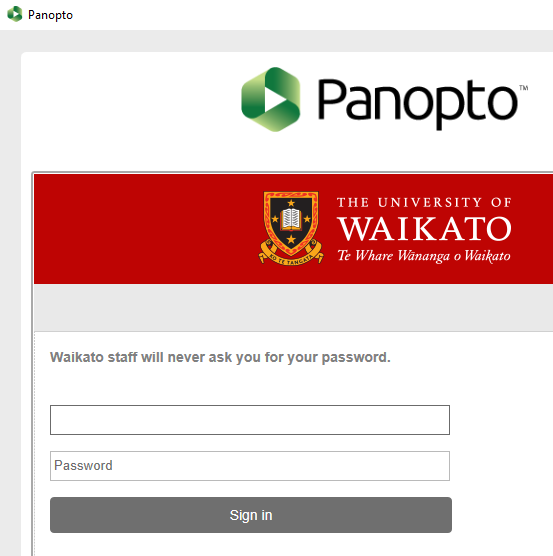
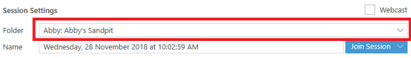
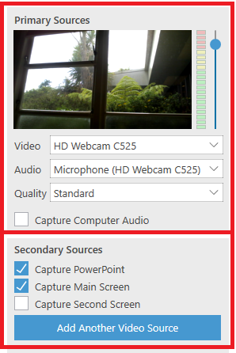
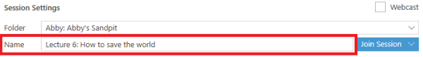
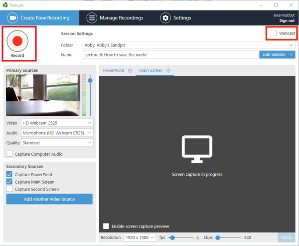
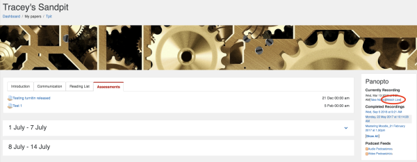
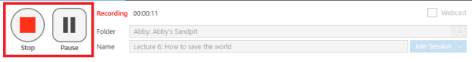
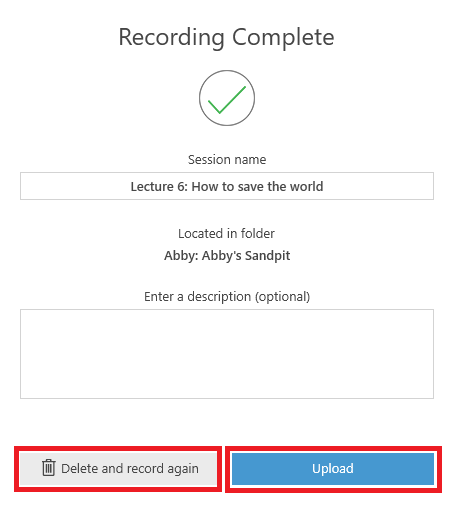

# Create a recording or Webcast

1. On your desktop, double-click the **Panopto icon** to open the **Panopto Recorder** program. Alternatively, you can search for the programme in your system.

2. Sign in with your standard Waikato username and password.

3. Select the drop-down arrow to select the **Folder** where you want to save your recording.

>! **Note:** If your desired paper/folder is not available, the folder or your access to the folder may not be correctly set up. You can record to another folder, and move the recording later.

4. Select **Primary Sources** and **Secondary Sources** (e.g. audio, video, screen, PPT, Document Camera).

>! **Note:** Ensure that you have selected an **Audio** source, and the sound meter shows audio levels are OK.

5. Name your recording so that it is easy for you and your participants to find.

6. To start recording, select the **Record button** in the top left-hand corner.

>! **Note:** If you want to broadcast the session to a live audience, select the tick box next to **Webcast** at the top right, then select **Record**.

>! **Note:** If you are webcasting students can access the live session by going to the **Panopto block** in the Moodle paper, and under **Currently Recording**, selecting **Watch Live**.

7. When you have finished recording, select **Stop**. This step saves your recording.

8. Select Delete and record again if you are not happy with your recording and want to re-do it, or Upload if it is fine.

>! **Note:** After selecting Upload, the recording will be first uploaded to the Panopto database, then processed before being made available for viewing, editing and sharing. You can log out after the upload is complete (make sure to not log out before), the processing will not be affected. The processing time may take up to a few hours.

- Create an offline recording
