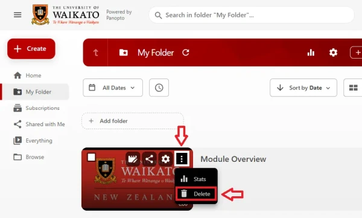
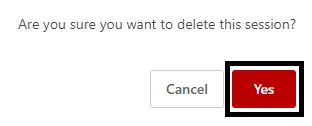
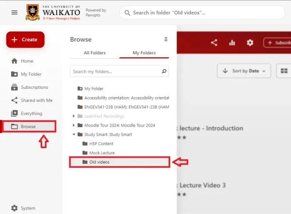
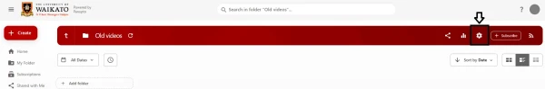
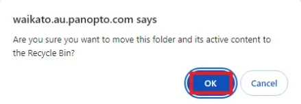

# Delete individual recording(s) or folders
## Delete a Recording
1. Go to the University of Waikato's Panopto server: <a href="https://waikato.au.panopto.com" target="_blank">https://waikato.au.panopto.com</a>

2. At the top right corner, click on **Sign in**.
  

3. **Sign in** with your standard University of Waikato username and password.
   

4. To delete recording(s), tick the small **Checkbox** at the top left of the recording's preview image. A list of icons will appear at the top of the screen. Select the **Bin** icon.

   
!> Note: You can also delete recording(s) by selecting the **three dots menu (⋮)** icon at the top right of the recording's preview image. Then, select **Delete**. 

5. Finally, select **Yes**.

  

!> Note: You can select several recordings in the same folder and delete them all at once. 

## Delete a Folder
1. Follow steps 1-3 from the previous section.
   
2. On the left hand side, use the Browse function to find the folder you wish to delete.

3. At the top right of the screen, select the settings cog.
   

4. In the next dialogue box, select Manage in the menu on the left hand side, then select Delete.

7. Finally, select OK.

