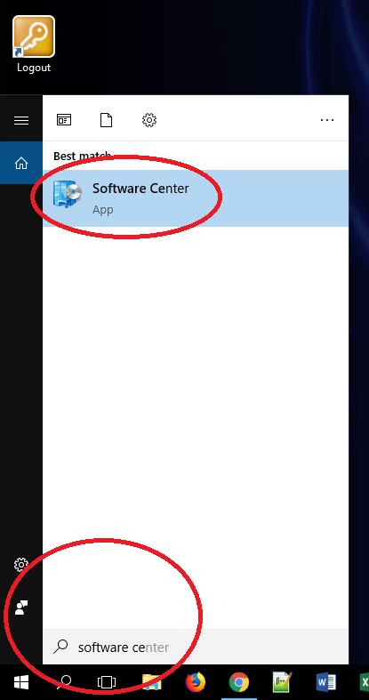
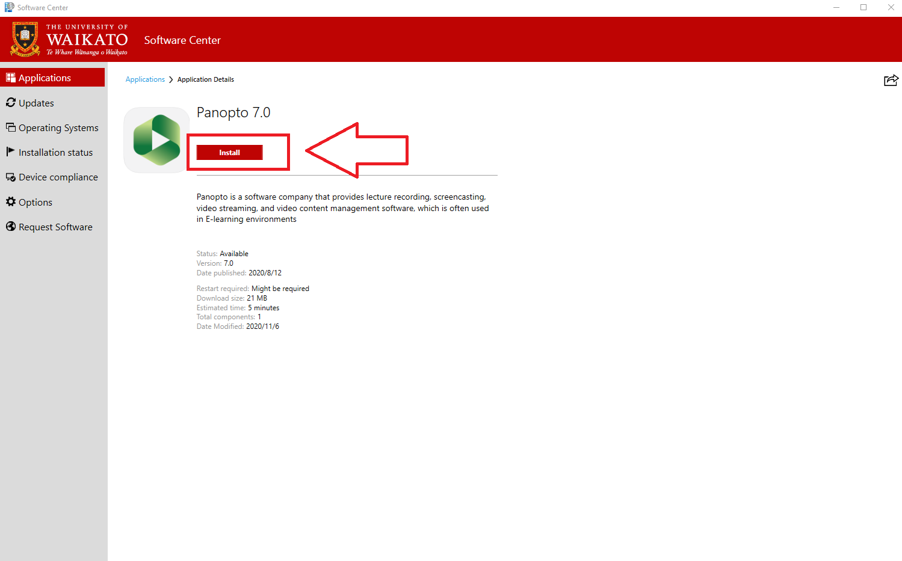
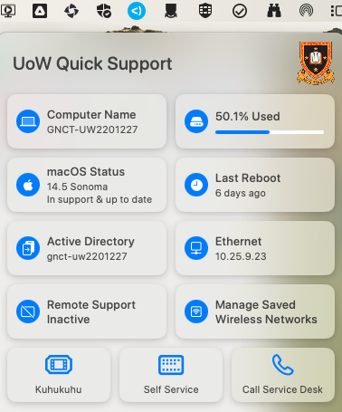

# Download and install Panopto
## From Software Center (Windows OS)
!> **Note:** This applies to university-issued devices.

1. Go to **Start** and search for **Software Center**
   
   
 
2. In the top right corner use the **search bar** to find **Panopto**.

3. Finally, select **Panopto** then **Install**.

## Self Service (Mac OS)
!> **Note:** This applies to university-issued devices.

1. Find **Self Service** on your Mac.

2. In the search bar on the top left corner, start typing **Panopto**.

3. Finally, select **Install Current** under the **Panopto Coursecast** icon.

## From the Panopto website

Not all computers have a tool installation application, especially if you are working on your personal computer. If you have admin authorisation to your computer, you can  download Panopto from the website.

1. Go to waikato.au.panopto.com
2. Log in with standard Waikato **username** and **password**.
3. In the top left corner, select **+ Create**.
4. Click on Panopto for Windows or Panopto for Mac.
5. Select Download Panopto.
6. When panoptorecorder.exe file downloads, select it.
7. Enter waikato.au.panopto.com into the Server Address and log in.

Note: For immediate assistance on installing Panopto, please contact the Service Desk on 838 4008, or log a request through the online self-service portal, Kuhukuhu.

