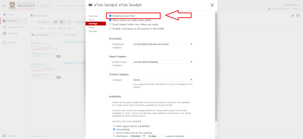
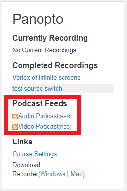

# Enabling RSS feed for a paper

> If you enable the RSS feed in Panopto, your paper participants can choose to receive notifications about new recordings. With RSS enabled, participants can connect the paper to their iTunes account, then download and view recordings via iTunes.

1. Go to the University of Waikato's Panopto server: [https://waikato.au.panopto.com](https://waikato.au.panopto.com/)

2. Select **Sign in**.

3. **Sign in** with a standard Waikato username and password.

4. On the left side of the page, select **Browse**. Select **My Folders**, and find the paper you want to enable the RSS feed for. Right click on it and select **Settings**.

5. In the **Settings** tab, tick the **Enable podcast feed** box. The modification will be saved automatically.

6. In **Moodle**, the option to subscribe to the audio or video RSS feed now appears in the Panopto block of the corresponding paper.

>? **Note:** By default, the RSS feed is enabled for a new paper. To disable it, follow those same steps and untick the **Enable podcast feed** box.
