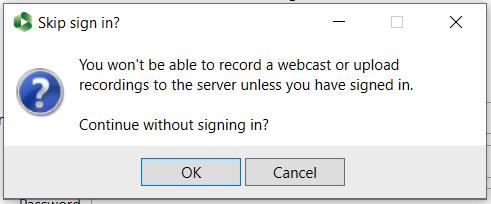
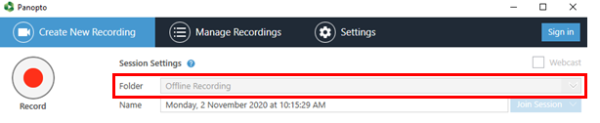
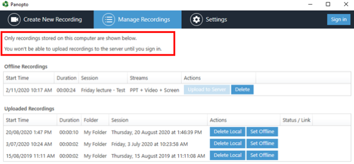
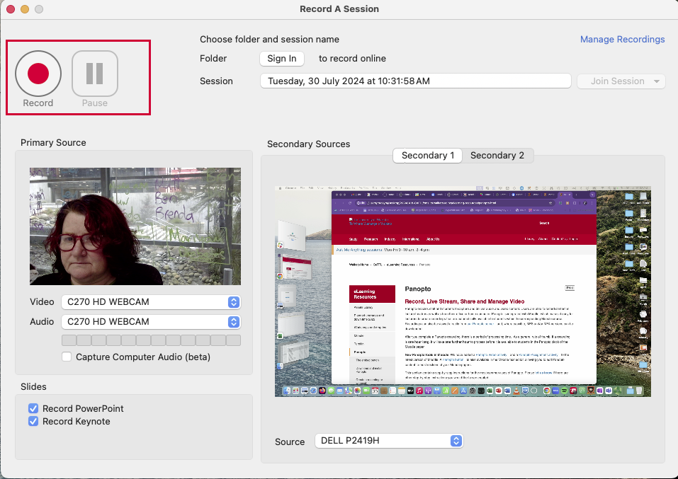

# Making‌ ‌an‌ ‌offline‌ ‌recording
> There may be times when you will not be able to record directly to Panopto.
>This might be due to a maintenance time or an upgrade.
>At these times you can make an offline recording.

## Windows
1. Open the Panopto client. On your desktop, double-click the **Panopto icon** to open the **Panopto Recorder**. Alternatively, you can search for the programme in your system.

2. Then select **Continue offline**

3. Select OK to verify you want to record offline

Your Folder will now be Offline Recording.

4. Record your session as normal. When you have finished your recording select Done.

Your recording is stored on your computer and can be uploaded the next time you sign in. 

# Mac
1. Open the Panopto Client

2. Do not sign in, select **Record**

4. Your recording is stored on your computer and can be uploaded the next time you sign in.

‌
