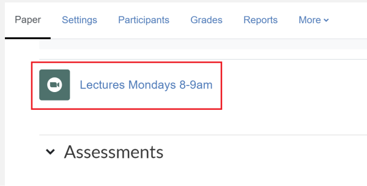
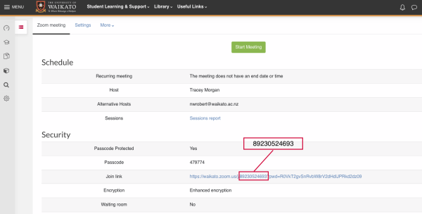
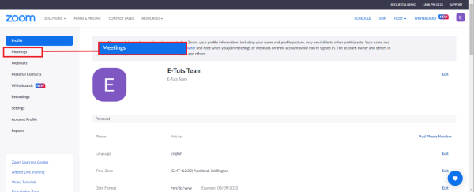
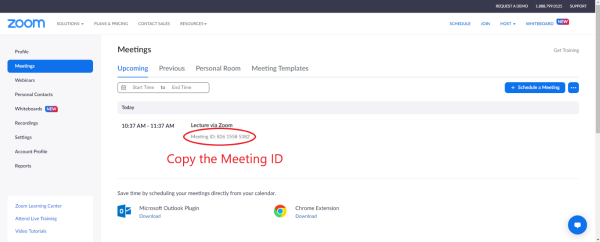
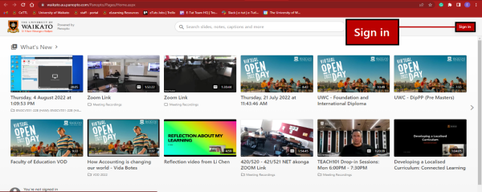
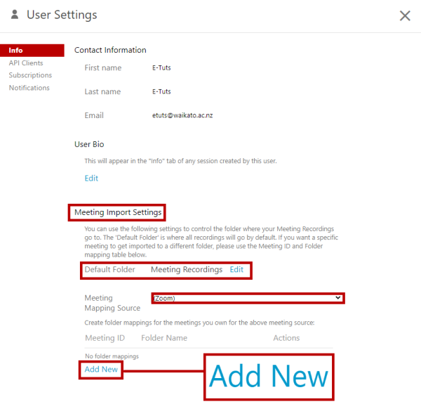
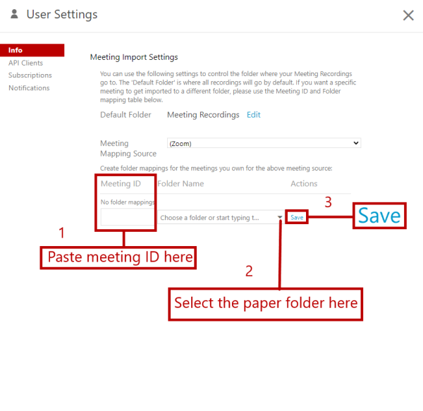

# Map Zoom recordings to Panopto folder

## Zoom meeting ID

Zoom recordings saved to the cloud will appear in your Meeting Recordings folder inside your personal My Folder in Panopto. You can transfer all the recordings in a recurring Zoom meeting, so long as you record to the cloud, to your paper's Panopto folder by remapping, rather than transferring recordings to the paper folder [manually](move-panopto-recordings.md) after each session. 

1. First, [schedule a Zoom session in Moodle](https://www.waikato.ac.nz/students/eresources/zoom/set-up-zoom-in-moodle/).

2. After you have created and saved the session, go to your main paper page and select the **Zoom meeting name**.

3. Scroll down to **Join link** and copy the meeting ID (**the number after j/**).

4. You may also find the meeting ID on your University of Waikato Zoom account page, which you can access by selecting the **bottom star** on the left of the staff landing page/[Te Hononga](https://waikatouniversitynz.sharepoint.com/sites/TeHononga/), then the **Zoom icon**.  See  Install and log in to Zoom for more information.

5. Select **Meetings** from the left hand menu.

6. Copy the **Meeting ID**, then double-check that the meeting ID and name match those on Moodle.

     
## Panopto linking

1. Once you have the Meeting ID go to the Panopto home page.

2. If you haven't already, please **Sign in**. Your profile image or initials should then appear at the top right of the Panopto main page. 

3. Select your **image** or **initials**, then select **User Settings** from the drop-down menu. 

4. In the pop-up window, under **Meeting Import Settings**, check that Default folder is set to Meeting recordings and the Meeting Mapping Source is set to Zoom. Then select **Add New**. 

5. Paste the meeting ID into the **Meeting ID** box on the left, then select the drop-down arrow under **Folder Name** to see your paper folders, or start typing the paper code. Select the paper folder, and finally select **Save** on the right. 

