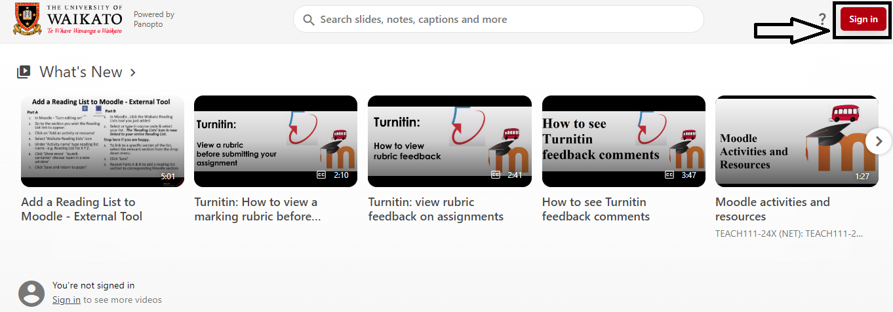
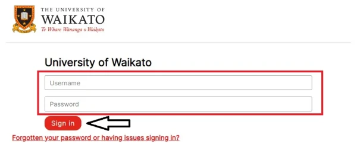
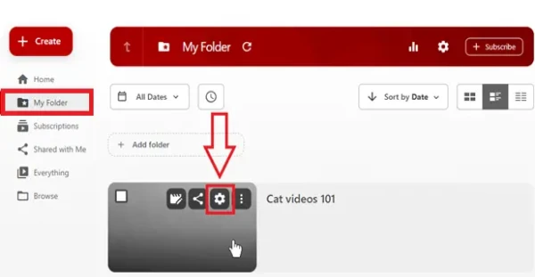
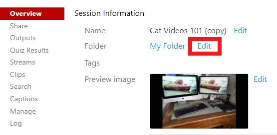
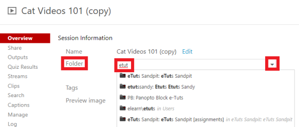
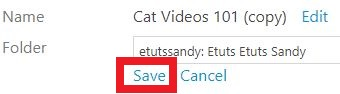
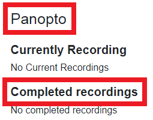

# Move Panopto recordings

> - Follow these steps to move a Zoom session recording from your personal My Folder to the Panopto block of a Moodle paper, or  other recordings from one of your Panopto folders to another.
> - You can also use the new Panopto Video resource or the Panopto embed button in Moodle to add a Panopto recording to a section of a Moodle paper, either from your personal folder or from another paper folder.
> - See also Copy recordings.

1. Go to the University of Waikato's Panopto server: [https://waikato.au.panopto.com](https://waikato.au.panopto.com)
2. At the top-right corner, select **Sign in** button.

3. **Sign in** with your standard Waikato **username** and **password**. 

4. On the left of the page, select **My Folder** to find the recording that you wish to move. Then, select the **Settings** icon.

**Note:** You can also select **Browse** at the bottom of the left-hand menu to find recordings from other folders.
5. In the **Overview** section of Settings tab, select **Edit** to the right of the current folder name.

6. Select the **drop-down arrow** to show a list of your available folders, and choose a folder.

**Note:** If you don't see your folder in the list, start typing the folder or paper name to refine the available selections. If the folder still doesn't appear, check your access rights to that paper.
8. Finally, select **Save** below the new folder name to move the recording.

**Note:** To check if the recording is available to students in a Moodle paper, go to the Moodle paper's **Panopto block**, which is usually on the right hand side. Your recording should appear under **Completed recordings**.

