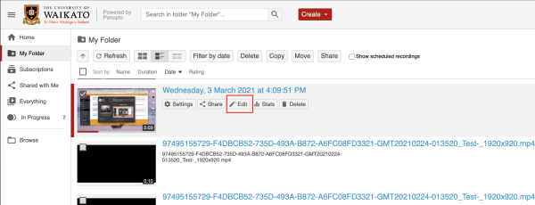
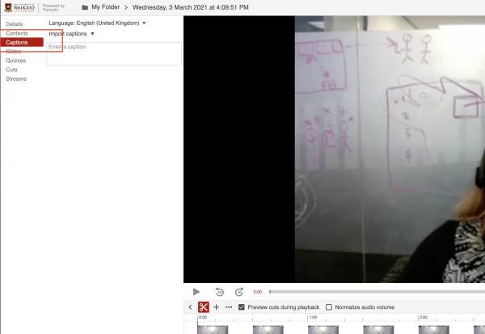
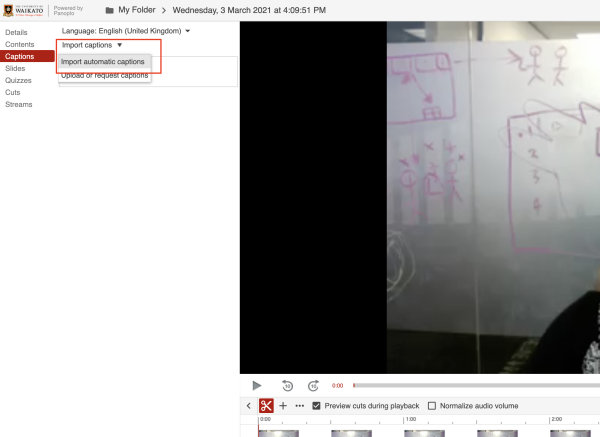
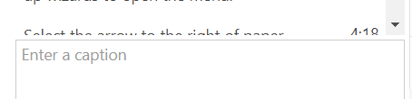
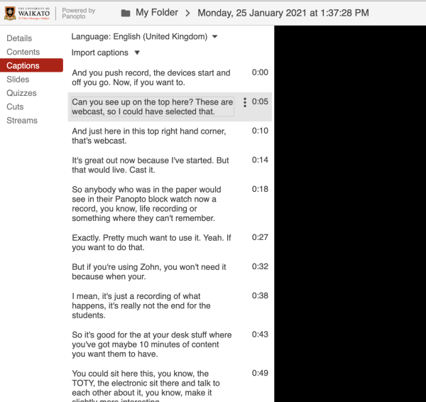

# Panopto Captions

You can add captions after uploading or recording audio or video to Panopto. This is also a good option for sessions captured via Zoom.

1. Hover over the recording you want to add captions to and select **Edit**.

2. On the top left, select **Captions**.

3. Select the **Import captions** dropdown and  select **Import automatic captions**.

4. The automatically generated captions will appear. Check and edit the captions by typing into each text box.

!> **Note:** You can jump to the relevant point in the video by selecting each caption.

!> **Note:** You can also stop the recording playback at a particular point, scroll down to the bottom of the automatic captions and **Enter a caption**. The caption will appear at the selected time.

## Ensuring good sound quality

Good sound recordings are not only better for listeners, but result in much more accurate captioning.

!> **Note:** If possible, for the benefit of students who may prefer to see you speak, record your face on camera.

### In lecture theatres and teaching rooms:

- Wear a lapel mic or use a microphone.
- Repeat any audience questions so they are recorded.

### When recording to your own device:

- Use an external (plug-in) microphone rather than the integrated sound capture. Small inexpensive microphones are also available for phones.
- Wear a headset: you will be much more aware of the sound quality than if you rely on your ears. We tend to filter out extraneous sounds that may mar the recording.
