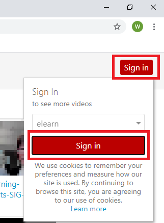

# Share folders

!> **Note:** If your Moodle paper has a configured Panopto block, paper participants can view the recordings in its Panopto folder. To share your folder with someone who is not a participant in its associated Moodle paper, follow these steps.

1. Go to the University of Waikato's Panopto server: [https://waikato.au.panopto.com](https://waikato.au.panopto.com)
2. Select **Sign in** using **elearn**, then select **Sign in**.

