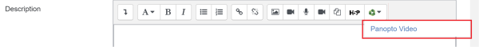
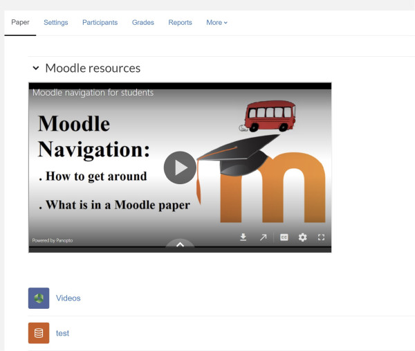
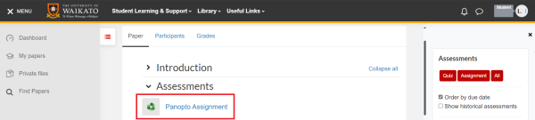
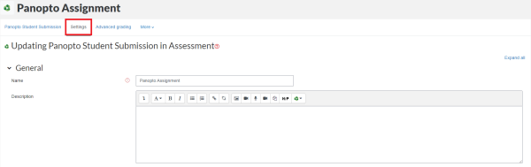
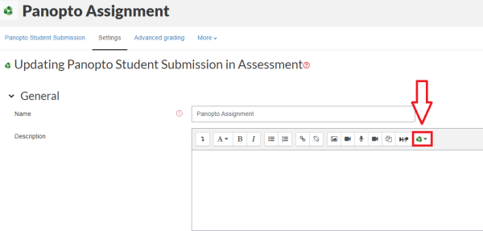
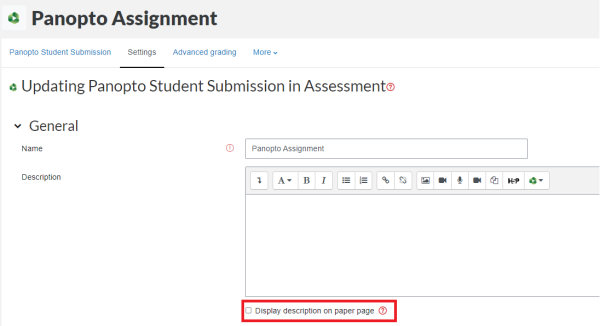
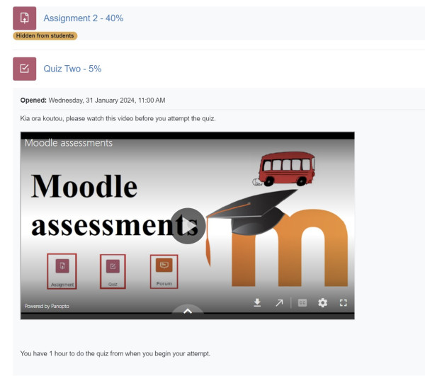

# The Panopto embed button

Utilise the Panopto button to access most Moodle activities and topics, weeks and sections.

You can add Panopto content to most Moodle activities and topics/weeks/sections using the Panopto button in the text editor.

- Topics/weeks/sections: the Panopto content will display as embedded video in your main Moodle paper page.
- Activities and Resources: you can choose whether to display the Panopto content as embedded video in your main page, or after students select the activity.

## Sections/Topics/Weeks

1. Go to your Moodle paper and at the top right of the page toggle **Edit mode on**.

3. To the right of the section/topic/week, select the **3 dots**, then select **Edit settings**.

5. In the General section, at the top right of the Summary text box, select the green **Panopto button**.

7. Click on **Panopto video**.

9. In the Panopto Video pop-up window, **Choose** Panopto content from the current paper or another paper, or **Upload** a file from your device, or **Record** directly to Moodle.

11. At the bottom right of the popup window, select **Insert**.

13. **Scroll down** and select **Save changes**.

!> **Note:** Your video will display in the section summary as in the example below, of a topic called 'Moodle resources'. Students can select the **arrow** on the video to play it from the paper's Moodle page.

## Activities and Resources

1. In your Moodle paper, select the Activity or Resource **name**.

3. Select the **Settings tab**.

5. In the General section, at the top right of the Description text box, select the green **Panopto button**.

6. Click on **Panopto video**.

7. In the Panopto Video pop-up window, **Choose** Panopto content from the current paper or another paper, or **Upload** a file from your device, or **Record** directly to Moodle.

8. At the bottom right of the popup window, select **Insert**.

!> **Note:** To display the Panopto content on your main Moodle page, tick **Display description on paper page** below the description text box.

7. Scroll down and select **Save and return to paper** or **Save and display**.

!> **Note:** If you tick Display description on paper page (step 6) your video will display as in the Quiz example below. Students can select the arrow on the video to play it from the paper's Moodle page. If you don't tick this box, students will see the Panopto content after they select the activity name.

